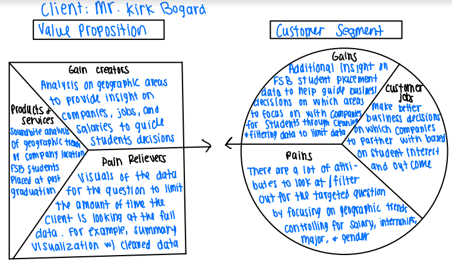

```{r setup, include=FALSE, echo = TRUE}
knitr::opts_chunk$set(echo = TRUE,message=FALSE,warning=FALSE)

#package intialization
rm(list = ls()) # clear global environment
graphics.off() # close all graphics
if(require(pacman)==FALSE) install.packages("pacman")
pacman::p_load(DataExplorer,tidyverse,readxl,zoo,stargazer,kableExtra,skimr,plotly,ggpubr,vtable,tm, gplots, ggplot)
```

# Introduction and Purpose

Annually, the FSB conducts a senior survey of graduates to learn of their employment status. In addition, information is verified using LinkedIn and employer survey information. The data you are provided ('FSB_BI_Survey_2019_2021.rds') contains data on graduates for 2019, 2020, and 2021. The data are merged from two sources: the senior survey, and data from the Miami University database.

The product and service this analysis will provide is a soundbite on the geographic trends in FSB placement data. Our clients will utilize our insights to help drive business decisions. For example, Miami University may decide to target companies from a specific geographic area, based on salary or job type to bring to career fair for a specific major. The provided dataset is comprehensive with 42 different attributes per row. This analysis will provide our client with meaningful insights without having to process the dataset. This pain killer will allow our clients to focus their time at work in other areas.

# Business Value Proposition



# Data Sources

The data file provided is from graduated students who completed this survey from 2019-2021.

## Read in the data

```{r, echo = TRUE}
data=readRDS(file = "FSB_BI_Survey_2019_2021.rds")

options(scipen = 999)
```

# Data Preprocessing

## Cleaning the Data

### Data Set Cleaning
```{r}
# Removing those who are "seeking continuing education", "continuing education", "not seeking employment"

ValueToRemove = c("seeking continuing education", "continuing education", "not seeking employment")

data_filtered <- data[!(data$survey_plans %in% ValueToRemove), ]

unique(data_filtered$survey_plans)
```

The first thing in cleaning the data is removing the levels of `survey_plans` that are not needed when evaluating geographic trends of those with a job.  This includes removing those individuals that have selected "seeking continuing education", "continuing education", "not seeking employment". 


```{r}
# Remove the specified columns by their column numbers
data_filtered2 <- data_filtered[, c(2,3,22,23,25,27,28,29,37,38,39,40,41,42)]
head(data_filtered2)
```

The next step in cleaning the data was removing unnecessary columns that are not needed when evaluating this dataset.  This will help narrowing down the 42 columns to a limited number of columns to help focus the analysis.


```{r}
colSums(is.na(data_filtered2))
```

```{r}
filtered <- subset(data_filtered2, !is.na(survey_plans))
colSums(is.na(filtered))
```

Once the dataset is finalized, the number of missing values was evaluated.  The first variable that needed to na values to get filtered out was survey_plans.  If they did not indicate what their future plans are, it would be hard to evaluate geographic trends.  It was noticed when looking at the data that some columns have city missing, but not state missing.  For this reason, the missing values for the remaining columns are going to be kept for now.  It may get filtered out later in the analysis.

### Cleaning State, City, and Job

```{r}

filtered$survey_state <- tolower(filtered$survey_state) # to lower case
filtered$survey_state <- gsub("[^a-zA-Z]", "", filtered$survey_state) # remove abbreviations
filtered$survey_state <- match(filtered$survey_state, tolower(state.abb)) # convert to numerical representations
filtered$survey_state <- state.name[(filtered$survey_state)]
print(unique(filtered$survey_state))
```

When evaluating the data, it was noticed that there were multiple levels for the same state.  For example: OH=ohio-oh=Ohio.  This was cleaned up so there is only 1 level per state listed. 

```{r}
filtered$survey_city <- tolower(filtered$survey_city) # to lower case
filtered$survey_city <- gsub("[^a-zA-Z]", "", filtered$survey_city) # remove abbreviations
filtered$survey_city <- gsub("\\s+", "", filtered$survey_city) # remove extra spaces
filtered$survey_city <- gsub(" city$", '' ,  filtered$survey_city) # remove string city on the end 

print(sort(unique(filtered$survey_city)))
```


```{r}
# to drop : indiana, dontknowyet, na, tbd, various

filtered$survey_city[filtered$survey_city == "cincinatti"] <- "cincinnati"
filtered$survey_city[filtered$survey_city == "cincinnnati"] <- "cincinnati"
filtered$survey_city[filtered$survey_city == "cincinnatioh"] <- "cincinnati"
filtered$survey_city[filtered$survey_city == 'findlaytentative'] <- 'findlay'
filtered$survey_city[filtered$survey_city == 'findley'] <- 'findlay'
filtered$survey_city[filtered$survey_city == 'ftmyers'] <- 'fortmyers'
filtered$survey_city[filtered$survey_city == 'hamiliton'] <- 'hamilton'
filtered$survey_city[filtered$survey_city == 'milwaukwee'] <- 'milwaukee'
filtered$survey_city[filtered$survey_city == 'newyork'] <- 'newyorkcity'
filtered$survey_city[filtered$survey_city == 'nyc'] <- 'newyorkcity'
filtered$survey_city[filtered$survey_city == 'philadephia'] <- 'philadelphia'
filtered$survey_city[filtered$survey_city == 'springfieldoh'] <- 'springfield'
filtered$survey_city[filtered$survey_city == 'washinton'] <- 'washington'
filtered$survey_city[filtered$survey_city == 'washingtondc'] <- 'washington'
filtered$survey_city[filtered$survey_city == 'westervillecolumbus'] <- 'westerville'
filtered$survey_city[filtered$survey_city == 'witchita'] <- 'wichita'

print(sort(unique(filtered$survey_city)))
```

```{r}
# Drop Rows with the following values : indiana, dontknowyet, na, tbd, various

ValueToRemove = c("indiana", "dontknowyet", "na", "tbd", "various", "NA")

filtered <- filtered[!(filtered$survey_city %in% ValueToRemove), ]

sort(unique(filtered$survey_city))
```
Same thing here as to the states. There were multiple levels for the same city.  The city names were cleaned up so there was only 1 level per city. 

```{r}
filtered$survey_company <- tolower(filtered$survey_company) # to lower case
print(sort(unique(filtered$survey_company)))
```


```{r}
filtered$survey_company[filtered$survey_company == "84.51º"] <- "84.51"
filtered$survey_company[filtered$survey_company == "abbott nutrition"] <- "abbott"
filtered$survey_company[filtered$survey_company == "abercrombie"] <- "abercrombie & fitch"
filtered$survey_company[filtered$survey_company == "aldi us" | filtered$survey_company == "aldi usa"] <- "aldi"
filtered$survey_company[filtered$survey_company == "american eagle outfitters" | filtered$survey_company == "american eagle outfitters, Inc."] <- "american eagle"
filtered$survey_company[filtered$survey_company == "amazon web services"] <- "amazon"
filtered$survey_company[filtered$survey_company == "american electric power (aep)"] <- "american electric power"
filtered$survey_company[filtered$survey_company == "ameriprise financial - redstone wealth advisors"] <- "ameriprise financial services"
filtered$survey_company[filtered$survey_company == "andersen"] <- "andersen tax"
filtered$survey_company[filtered$survey_company == "ankura"] <- "ankura consulting"
filtered$survey_company[filtered$survey_company == "ayco, a goldman sachs company"] <- "ayco"
filtered$survey_company[filtered$survey_company == "barclays"] <- "barclays investment bank"
filtered$survey_company[filtered$survey_company == "bath & body works"] <- "bath and body works"
filtered$survey_company[filtered$survey_company == "baxter"] <- "baxter international"
filtered$survey_company[filtered$survey_company == "bdo usa" | filtered$survey_company == "bdo usa llp"] <- "bdo"


sort(unique(filtered$survey_company))
```


# The rest of your document

Add sections and subsections as necessary to guide your analysis
