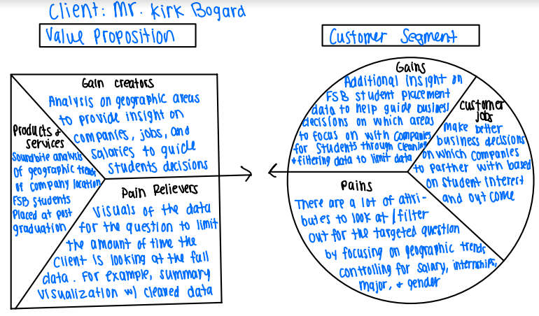

```{r setup, include=FALSE, echo = TRUE}
knitr::opts_chunk$set(echo = TRUE,message=FALSE,warning=FALSE)

#package intialization
rm(list = ls()) # clear global environment
graphics.off() # close all graphics
if(require(pacman)==FALSE) install.packages("pacman")
pacman::p_load(DataExplorer,tidyverse,readxl,zoo,stargazer,kableExtra,skimr,plotly,ggpubr,vtable,tm, gplots, ggplot)
```

# Introduction and Purpose

Annually, the FSB conducts a senior survey of graduates to learn of their employment status. In addition, information is verified using LinkedIn and employer survey information. The data you are provided ('FSB_BI_Survey_2019_2021.rds') contains data on graduates for 2019, 2020, and 2021. The data are merged from two sources: the senior survey, and data from the Miami University database.

The product and service this analysis will provide is a soundbite on the geographic trends in FSB placement data. Our clients will utilize our insights to help drive business decisions. For example, Miami University may decide to target companies from a specific geographic area, based on salary or job type to bring to career fair for a specific major. The provided dataset is comprehensive with 42 different attributes per row. This analysis will provide our client with meaningful insights without having to process the dataset. This pain killer will allow our clients to focus their time at work in other areas.

# Business Value Proposition



# Data Description

The data file provided is from graduated students who completed this survey from 2019-2021. The files contains 42 variables (columns) with 3,235 observations. There are 4 variables that are factors, 18 variables that are integers or numeric, and 20 variables that are characters.

## Read in the data

```{r, echo = TRUE}
data=readRDS(file = "FSB_BI_Survey_2019_2021.rds")

options(scipen = 999)
```

# Data Preprocessing

## Cleaning the Data

```{r}
# Removing those who are "seeking continuing education", "continuing education", "not seeking employment"

ValueToRemove = c("seeking continuing education", "continuing education", "not seeking employment")

data_filtered <- data[!(data$survey_plans %in% ValueToRemove), ]

unique(data_filtered$survey_plans)
```

The first thing in cleaning the data is removing the levels of `survey_plans` that are not needed when evaluating geographic trends of those with a job.  This includes removing those individuals that have selected "seeking continuing education", "continuing education", "not seeking employment". 


```{r}
# Remove the specified columns by their column numbers
data_filtered2 <- data_filtered[, c(2,3,22,23,25,27,28,29,37,38,39,40,41,42)]
head(data_filtered2)
```

The next step in cleaning the data was removing unnecessary columns that are not needed when evaluating this dataset.  This will help narrowing down the 42 columns to a limited number of columns to help focus the analysis.

```{r}
plot_missing(data_filtered2)
```

Since we want to look at entries with survey plans listed, missing values for survey plans were removed. 

```{r}
filtered <- subset(data_filtered2, !is.na(survey_plans))
plot_missing(filtered)
```

Once the dataset is finalized, the number of missing values was evaluated.  The first variable that needed to na values to get filtered out was survey_plans.  If they did not indicate what their future plans are, it would be hard to evaluate geographic trends.  It was noticed when looking at the data that some columns have city missing, but not state missing.  For this reason, the missing values for the remaining columns are going to be kept for now.  It may get filtered out later in the analysis.

### Cleaning State, City, and Job

#### Cleaning the State

```{r}
filtered$survey_state <- tolower(filtered$survey_state) # to lower case
filtered$survey_state <- gsub("[^a-zA-Z]", "", filtered$survey_state) # remove abbreviations
filtered$survey_state <- match(filtered$survey_state, tolower(state.abb)) # convert to numerical representations
filtered$survey_state <- state.name[(filtered$survey_state)]
print(unique(filtered$survey_state))
```

When evaluating the data, it was noticed that there were multiple levels for the same state.  For example: OH=ohio-oh=Ohio.  This was cleaned up so there is only 1 level per state listed. 

#### Cleaning the City name

```{r}
filtered$survey_city <- tolower(filtered$survey_city) # to lower case
filtered$survey_city <- gsub("[^a-zA-Z]", "", filtered$survey_city) # remove abbreviations
filtered$survey_city <- gsub("\\s+", "", filtered$survey_city) # remove extra spaces
filtered$survey_city <- gsub(" city$", '' ,  filtered$survey_city) # remove string city on the end 

#sort(unique(filtered$survey_city))
```

This task requires some extra cleaning to be done by hand for misspelled cities 
```{r}
# to drop : indiana, dontknowyet, na, tbd, various
filtered$survey_city[filtered$survey_city == "cincinatti"] <- "cincinnati"
filtered$survey_city[filtered$survey_city == "cincinnnati"] <- "cincinnati"
filtered$survey_city[filtered$survey_city == "cincinnatioh"] <- "cincinnati"
filtered$survey_city[filtered$survey_city == 'findlaytentative'] <- 'findlay'
filtered$survey_city[filtered$survey_city == 'findley'] <- 'findlay'
filtered$survey_city[filtered$survey_city == 'ftmyers'] <- 'fortmyers'
filtered$survey_city[filtered$survey_city == 'hamiliton'] <- 'hamilton'
filtered$survey_city[filtered$survey_city == 'milwaukwee'] <- 'milwaukee'
filtered$survey_city[filtered$survey_city == 'newyork'] <- 'newyorkcity'
filtered$survey_city[filtered$survey_city == 'nyc'] <- 'newyorkcity'
filtered$survey_city[filtered$survey_city == 'philadephia'] <- 'philadelphia'
filtered$survey_city[filtered$survey_city == 'springfieldoh'] <- 'springfield'
filtered$survey_city[filtered$survey_city == 'washinton'] <- 'washington'
filtered$survey_city[filtered$survey_city == 'washingtondc'] <- 'washington'
filtered$survey_city[filtered$survey_city == 'westervillecolumbus'] <- 'westerville'
filtered$survey_city[filtered$survey_city == 'witchita'] <- 'wichita'

#sort(unique(filtered$survey_city))
```

Thurthermore, drop rows with values for city name that are irrelevant to our analysis : (indiana, dontknowyet, na, tbd, various)

```{r}
# Drop Rows with the following values : indiana, dontknowyet, na, tbd, various

ValueToRemove = c("indiana", "dontknowyet", "na", "tbd", "various", "NA")

filtered <- filtered[!(filtered$survey_city %in% ValueToRemove), ]

sort(unique(filtered$survey_city))
```
Same thing here as to the states. There were multiple levels for the same city.  The city names were cleaned up so there was only 1 level per city. 

#### Cleaning the Job name
This was a daunting task as there were too many incorrectly entered job titles to comfortably do this by hand. Instead, we created a function that groups entries with similiar names together, under a single job name based on a computed string distance. This method was tested with different thresholds, lower ones being more strict and higher ones being less strict until a threshold = 0.2 was decided on because it correctly clusters names without incorrectly grouping (at the expense of only a few duplicate clusters). 
```{r}
library(stringdist)

# Load your survey data into a data frame (replace this with your actual data)
survey_data <- filtered
survey_data <- survey_data[complete.cases(survey_data$survey_company), ]

# Create a function to cluster similar company names with emphasis on the first word (case-insensitive)
cluster_similar_names <- function(data, threshold = 0.7) {
  # Convert company names to lowercase
  data$survey_company <- tolower(data$survey_company)
  
  # Extract the first word from each company name and convert to lowercase
  data$first_word <- sapply(strsplit(data$survey_company, " "), function(x) tolower(x[1]))

  # Calculate the string distances between lowercase first words
  dist_matrix <- stringdistmatrix(data$first_word, data$first_word, method = "jw")

  # Create a hierarchical clustering based on string distances
  hclust_result <- hclust(as.dist(dist_matrix))

  # Cut the tree into clusters based on the threshold
  clusters <- cutree(hclust_result, h = threshold)

  # Add the cluster IDs to the original data frame
  data$survey_company_id <- clusters

  # Create a named vector of cluster IDs to the first company name in each cluster
  cluster_names <- sapply(1:max(clusters), function(cluster_id) {
    first_company_in_cluster <- data$survey_company[clusters == cluster_id][1]
    return(first_company_in_cluster)
  })

  # Add the cluster names to the original data frame
  data$survey_company_cluster_name <- cluster_names[clusters]

  # Remove the temporary 'first_word' column if you don't need it
  data$first_word <- NULL

  return(data)
}

# Set a threshold for clustering (adjust as needed)
threshold <- 0.2

# Cluster similar company names with emphasis on the first word (case-insensitive)
clustered_data <- cluster_similar_names(survey_data, threshold)

# Sort and print unique company names before and after clustering
print("Unique Company Names Before Clustering:")
#print(sort(unique(filtered$survey_company)))

print("Unique Company Names After Clustering:")
print(sort(unique(clustered_data$survey_company_cluster_name)))


```


```{r}
clustered_data <- subset(clustered_data, select = -survey_company_id)
head(clustered_data, n = 10)
```


## Exploratory Data Analysis

This EDA will help to see if there is any additional cleaning that needs to happen. 

```{r}
create_report(clustered_data)
```
When looking at the overall EDA report, we can conclude the following.  

1) the number of missing values that are left are in the "ok" range.  We are going to keep the number of missing values were they are as we know some cities are listed but not their corresponding state.  Additional missing values filtering may be needed, but will be evaluated at that point.  

2) When looking at the histogram for the salary, there is a student who reported a salary of $175,000.  This is considered an outlier given the rest of the salary data is much less.  However, we are going to treat this value as true to what it is.  

3) According to the normal QQ plot and the histogram, the salary data is roughly distributed normally.  With the results of the EDA, we are going to keep the cleaning where it is at to start the analysis.  If we need to go back and clean as we go through the analysis, we will do the necessary cleaning to boost the analysis


##### R Version results were produced in
```{r, echo = FALSE}
R.version
```

