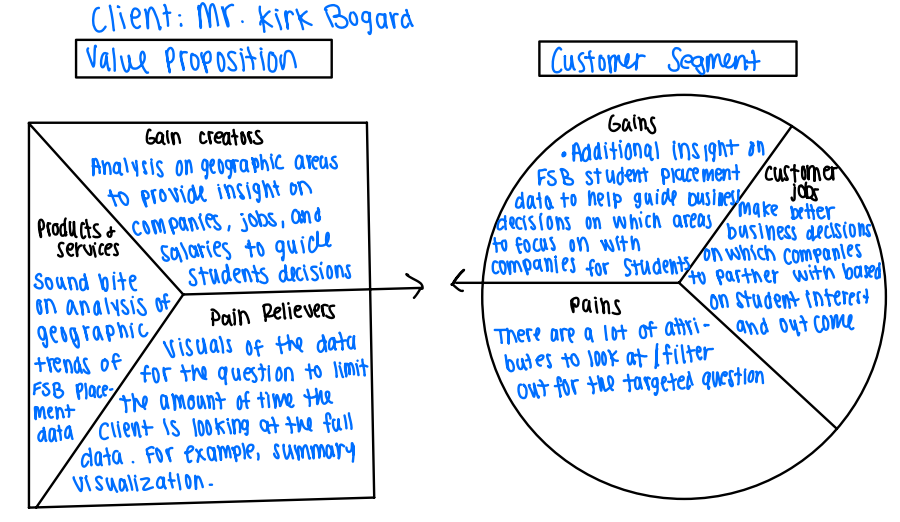

```{r setup, include=FALSE}
knitr::opts_chunk$set(echo = TRUE,message=FALSE,warning=FALSE)

#package intialization
rm(list = ls()) # clear global environment
graphics.off() # close all graphics
if(require(pacman)==FALSE) install.packages("pacman")
pacman::p_load(DataExplorer,tidyverse,readxl,zoo,stargazer,kableExtra,skimr,plotly,ggpubr,vtable,tm)
```

# Introduction and Purpose

Annually, the FSB conducts a senior survey of graduates to learn of their employment status. In addition, information is verified using LinkedIn and employer survey information. The data you are provided ('FSB_BI_Survey_2019_2021.rds') contains data on graduates for 2019, 2020, and 2021. The data are merged from two sources: the senior survey, and data from the Miami University database.

The product and service this analysis will provide is a soundbite on the geographic trends in FSB placement data. Our clients will utilize our insights to help drive business decisions. For example, Miami University may decide to target companies from a specific geographic area, based on salary or job type to bring to career fair for a specific major. The provided dataset is comprehensive with 42 different attributes per row. This analysis will provide our client with meaningful insights without having to process the dataset. This pain killer will allow our clients to focus their time at work in other areas.

# Business Value Proposition



# Data Sources

The data file provided is from graduated students who completed thsi survey from 2019-2021.

## Read in the data

```{r}
data=readRDS(file = "FSB_BI_Survey_2019_2021.rds")
```

# Data Preprocessing

Describing each data preprocessing step with small chunks of code, output where necessary, and documentation

# The rest of your document

Add sections and subsections as necessary to guide your analysis
